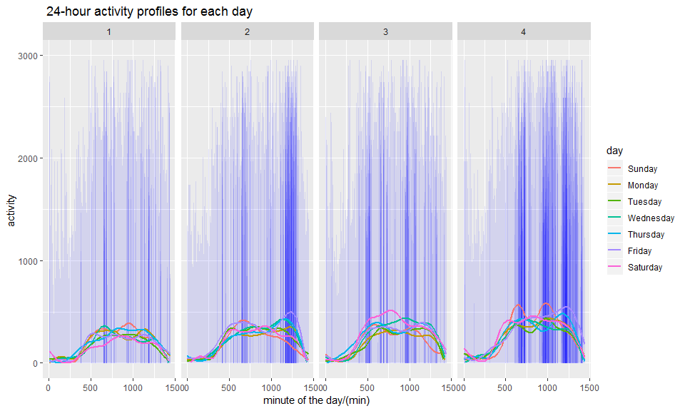

p8105\_mtp\_cy2522
================
Chu YU
2018-10-20

overview
--------

-   Accelerometers, as device for studying physical activity, can measure electrical signals that are a proxy for acceleration. Data of this project was collected on a 63 year-old male diagnosed with congestive heart failure. So we can get dynamic update of patient status from the data.

problem 1
---------

### data cleaning

``` r
mtp_tidy = read.csv("./data/p8105_mtp_data.csv") %>%
  janitor::clean_names() %>%
  gather(key = activity_number, value = activity, activity_1:activity_1440 ) %>%
  mutate(day = 
           factor(day,levels = c("Sunday", "Monday", "Tuesday", "Wednesday", "Thursday", "Friday", "Saturday")),
         activity_number = 
           as.numeric(str_replace(activity_number, "activity_", "")))
```

-   I cleaned the names, gathered and mutated the variables to make the data tidy. Finally there are **473760 observations of 4 variables** in it.

### exploratory analyses

``` r
## the structure of the data
str(mtp_tidy)
```

    ## 'data.frame':    473760 obs. of  4 variables:
    ##  $ week           : int  1 1 1 1 1 1 1 2 2 2 ...
    ##  $ day            : Factor w/ 7 levels "Sunday","Monday",..: 6 2 7 1 5 3 4 6 2 7 ...
    ##  $ activity_number: num  1 1 1 1 1 1 1 1 1 1 ...
    ##  $ activity       : num  1 1 1 1 1 1 1 1 1 1 ...

``` r
### explore the number of "1"
mtp_tidy %>%
  filter(activity == 1.00000) %>%
  group_by(week) %>% 
  summarise(n = n())
```

    ## # A tibble: 47 x 2
    ##     week     n
    ##    <int> <int>
    ##  1     1  5185
    ##  2     2  6040
    ##  3     3 10069
    ##  4     4  8753
    ##  5     5  3988
    ##  6     6  3589
    ##  7     7  4963
    ##  8     8  5193
    ##  9     9  4201
    ## 10    10  4033
    ## # ... with 37 more rows

``` r
### outliers
mtp_tidy %>%
  mutate(week = factor(week)) %>%
  ggplot(aes(x = week, y = activity)) +
    geom_boxplot() +
    theme(axis.text.x = element_text(angle = 60, hjust = 1))
```


-   In my tidy dataset, numeric variables are `activity_number` and `activity`, integer is `week`, and factor variable is `day`.

-   Exploratory data includes a table about time of voltage signals larger than 1, a boxplot for outliers, and structure of data. From the table we can know the different activity time every week.
    We can see from the plot the outliers get higher gradually across the weeks.

problem 2
---------

### explore the hypothesis that this participant became more active over time

``` r
##aggregate the data
mtp_total = mtp_tidy %>%
  group_by(week, day) %>%
  summarise(total_activity = sum(activity)) %>%
  mutate(day_num = row_number(day) + (week - 1) * 7) 

mtp_total %>%
  ggplot(aes( x = day_num, y = total_activity)) +
  geom_point() +
  geom_smooth(se = FALSE, color = "red") +
  theme(axis.text.x = element_text(angle = 90, hjust = 1)) +
  labs( 
    title = " plot of activity across the weeks ",
    x = "day",
    y = "activity of the day")
```

    ## `geom_smooth()` using method = 'loess' and formula 'y ~ x'


``` r
act_day = lm(total_activity ~ day_num, data = mtp_total)
```

-   Firstly, I added variable of sum of voltages in a day, then got a **scatterplot** of activity across the weeks where x is day of week and y is total activity of a day.

-   From the increasing mooth line in the plot we can know that the participant became more active over time.

-   To make tendency clearer, I had a simple linear regression line and got **intercept 251539 and slope 573**.

### examine the possibility that day of the week affects activity

``` r
## the effect of the day in a week
mtp_total %>%
  ggplot(aes(x = factor(day), y = total_activity, fill = day)) +
  geom_boxplot() +
  labs( 
    title = " effect of each day (in isolation)",
    x = "day",
    y = "activity ") +
  theme(axis.text.x = element_text(angle = 60, hjust = 1))
```


``` r
lm(total_activity ~ day, data = mtp_total) %>%
  anova()
```

    ## Analysis of Variance Table
    ## 
    ## Response: total_activity
    ##            Df     Sum Sq    Mean Sq F value Pr(>F)
    ## day         6 2.1742e+11 3.6237e+10  1.5832 0.1513
    ## Residuals 322 7.3699e+12 2.2888e+10

``` r
mtp_total %>%
  ggplot(aes(x = week, y = total_activity)) +
  geom_point(alpha = .5) +
  geom_smooth() +
  facet_grid(.~ day)  +
  labs( 
    title = " effect of each day (in addition to effect of time) ",
    x = "week",
    y = "activity") +
  theme(axis.text.x = element_text(angle = 60, hjust = 1))
```

    ## `geom_smooth()` using method = 'loess' and formula 'y ~ x'


``` r
lm(total_activity ~ factor(week), data = mtp_total) %>%
  anova()
```

    ## Analysis of Variance Table
    ## 
    ## Response: total_activity
    ##               Df     Sum Sq    Mean Sq F value    Pr(>F)    
    ## factor(week)  46 2.7977e+12 6.0820e+10  3.5809 2.522e-11 ***
    ## Residuals    282 4.7897e+12 1.6985e+10                      
    ## ---
    ## Signif. codes:  0 '***' 0.001 '**' 0.01 '*' 0.05 '.' 0.1 ' ' 1

-   The first **boxplot** has day as x and activity as y. From the plot we can know: there is an increasing tendency of effect from Tuesday to Friday, and a decreasing tendency from Friday to Tuesday. The participant is most active on Fridays and least active on Tuesdays. But from anova, I think there is no difference between days at 0.05 sig.level.

-   The second **scatterplot** has week as x and activity as y. We can see Sunday and Friday have more increasing effects on activity than other days. Anova shows there are differences at 0.05 sig.level meaning week has effect.

problem 3
---------

### 24-hour activity profiles

``` r
## the distribution of activity
mtp_tidy %>%
  mutate( season = factor(week %/% 12 + 1)) %>%
  ggplot(aes(x = activity_number, y = activity)) +
  geom_line(alpha = .1, color = "blue") +
  facet_grid(. ~ season) +
  geom_smooth(se = FALSE,  aes(color = day)) +
  ylim(0,3000) +
  labs( 
    title = " 24-hour activity profiles for each day ",
    x = "minute of the day/(min)",
    y = "activity ") 
```

    ## `geom_smooth()` using method = 'gam' and formula 'y ~ s(x, bs = "cs")'

    ## Warning: Removed 943 rows containing non-finite values (stat_smooth).

    ## Warning: Removed 21 rows containing missing values (geom_smooth).



``` r
wordcountaddin::text_stats("p8105_mtp_cy2522.Rmd")
```

| Method          | koRpus      | stringi       |
|:----------------|:------------|:--------------|
| Word count      | 498         | 482           |
| Character count | 2896        | 2895          |
| Sentence count  | 27          | Not available |
| Reading time    | 2.5 minutes | 2.4 minutes   |

-   Eventually, I made a line plot which is divided into 4 panels by season (12 weeks as one season) which shows both the 24-hour activity profiles for each day and effects of time and day of the week on 24-hour activity . I set the y-limit (0,3000) to make the plot clearer.

-   From the 24-hour smooth line, we can see the participant becomes more active from approximately 500th to 1250th minute and gradually becomes peaceful. So we can see maybe his sleeping hours is from 11 p.m. to 7 a.m. and then begins new day’s activity.

-   From panels, we can see that the participant tended to get up later on weekends than other working days, and he was more active at Friday nights around 8 p.m. Overall, in the first season, he was least active at weekends, and gradually became more active at weekends, maybe because he was recovering during the 47 weeks.
